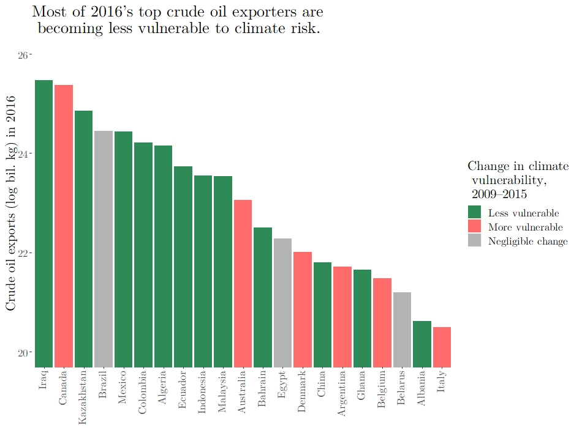
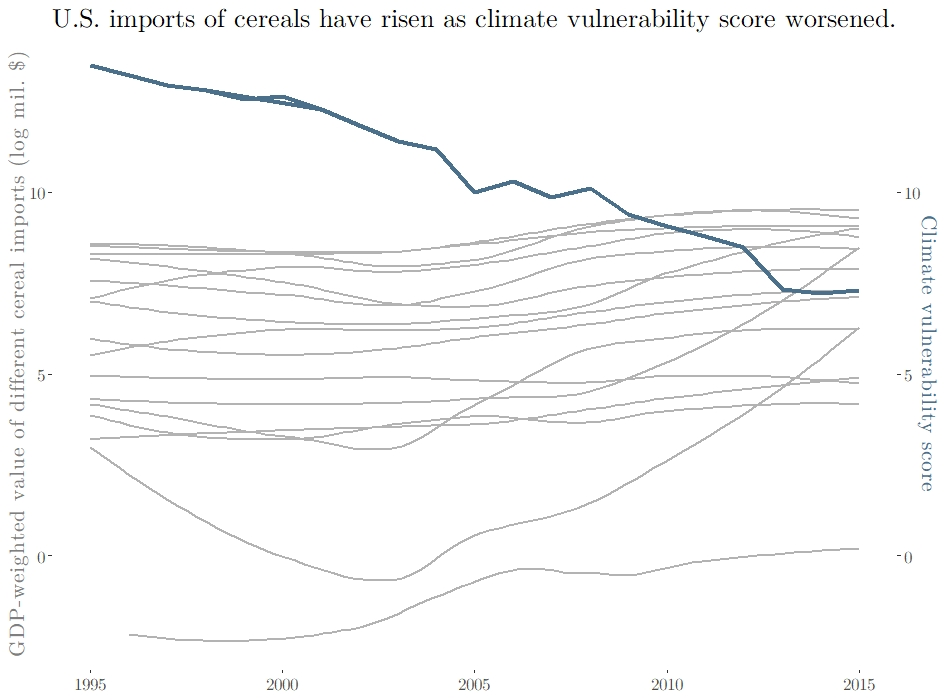

# How might climate change shift global trade flows?

This project will allow users to explore the relationship between global climate change risk and trade flows. Drawing from two decades of [Notre Dame Global Adaptation Initiative](https://gain.nd.edu/our-work/country-index/download-data/) scores, which rate countries along 45 indicators of climate vulnerability and preparedness, and over [8 million](https://www.kaggle.com/unitednations/global-commodity-trade-statistics/) traded commodity figures for 200+ countries, the interactive portal will use statistical learning techniques to produce projections of trade shifts based on user input. For example, if India's urban population increases and rural share decreases, how might its imports of fertilizers change? If social inequality climbs by 10 percent in Brazil, how might its exports of petroleum change? Users will be able to select a country of interest and tweak input variables—any number of ND-GAIN indicators—and see how future commodity flows could shift based on an algorithmic interpretation of historical data.

Try out a [demo of the app here](https://gbwalker.shinyapps.io/climate_demo/) that focuses on the BRICS countries, the world's five largest developing nations: Brazil, Russia, India, China, and South Africa.

The figures below show two basic insights about the data. First, some of the largest crude oil exporters are becoming *less* vulnerable to climate risks. In what dimensions are they performing well? Are those at greater climate risk trading less petroleum products over time?

Second, U.S. cereal imports have climbed as climate risk increased. What risk indicators are most associated with other changing imports in the United States? What projections would a statistical model suggest based on the trends of the past twenty years?

* The first phase of the project will consist of building a minimum viable product that juxtaposes climate scores and commodity trading trends for a handful of major countries and products with robust data.
* The second phase will be implementing the models that generate predictions based on user input (e.g., "5 percent increase in the inequality score of the United States over the next 20 years").
* The third phase will be incorporating as many countries and commodities as possible for a more robust user experience.
